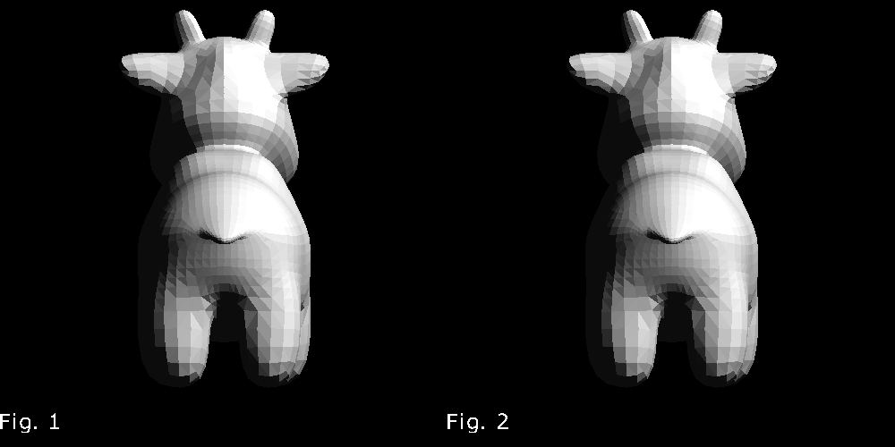

## 3D 变换

和[2D](../2.2d-matrix/READMM.md)变化类似，3D情况下用一个4维矩阵来表示某种变化

## 平移
```math
\begin{align}
\begin{bmatrix}
 1 & 0 & 0 & dx \\
 0 & 1 & 0 & dy \\
 0 & 0 & 1 & dz \\
 0 & 0 & 0 & 1
\end{bmatrix}
\begin{pmatrix}
x \\
y \\
z \\
1
\end{pmatrix}
=
\begin{pmatrix}
x' \\
y' \\
z' \\
1
\end{pmatrix} \\ 
T(d_{x},d_{y},d_{z}) = 
\begin{bmatrix}
 1 & 0 & 0 & dx \\
 0 & 1 & 0 & dy \\
 0 & 0 & 1 & dz \\
 0 & 0 & 0 & 1
\end{bmatrix}
\end{align}
```

## 缩放

```math
\begin{align}
\begin{bmatrix} 
 s_{x} & 0 & 0 & 0 \\ 
 0 & s_{y} & 0 & 0 \\
 0 & 0 & s_{z} & 0 \\ 
 0 & 0 & 0 & 1
\end{bmatrix} 
\begin{pmatrix}
x \\ 
y \\ 
z \\ 
1
\end{pmatrix}
=
\begin{pmatrix}
x' \\ 
y' \\ 
z' \\ 
1  
\end{pmatrix}\\
S(s_{x},s_{y},s_{z})=
\begin{bmatrix} 
 s_{x} & 0 & 0 & 0 \\ 
 0 & s_{y} & 0 & 0 \\
 0 & 0 & s_{z} & 0 \\ 
 0 & 0 & 0 & 1
\end{bmatrix} 
\end{align}
```

## Viewport 变化

这里，模型的坐标在一个标准立方体内，既x,y,z 三个坐标都是的[-1,1]这个区间内。可以通过一些平移和缩放变化，可以将其坐标变换到屏幕坐标（图像坐标）。$`M=S(width,height,1)S(0.5,0.5,1)T(1,1,0)`$. 这里变化的应用顺序是从右到左。T(1,1,0), 将x,y 都向各自的正方向平移了一个单位，z方向不变，因为这里z只用来做隐藏面剔除，和渲染结果图片的大小没有关系。这个变换后，x和y的范围都是[0,2] 。接下来，S(0.5,0.5,1) 接x,y的缩小至原来的一半，x和y的范围变成[0,1] ，最后S(width,height)将x和y的范围分别放大至[0,width] [0,height].

当然，先缩小一半再放大的这两个变化可以直接用S(width/2,height/2,1)来表示。

## 运行
```
cargo run --example transform_3d_viewport
```



