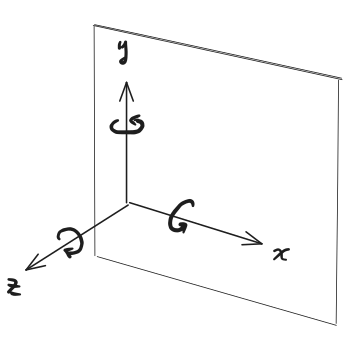

## 三维空间的基本旋转

三维空间有三种基本的旋转，分别为绕三个轴的旋转。上图展示了绕三个轴旋转的正方向。z轴垂直于屏幕（或渲染图片）向外。

### 绕z轴旋转

绕z轴旋转时，z坐标保持不变。x,y坐标的旋转方式和2D空间相同。

<!--
{ (x'=cos(alpha)x-sin(alpha)y),(y'=sin(alpha)x+cos(alpha)y):}
-->

写成矩阵形式：

<!--
[[cos(alpha),-sin(alpha),0,0],
 [sin(alpha),cos(alpha),0,0],
 [0         ,0         ,1,0],
 [0         ,0         ,0,1]]
((x),(y),(z),(1)) = 
((x'),(y'),(z'),(1))
-->

### 绕y轴旋转

绕y轴旋转的时候，y坐标保持不变。xoz 平面上旋转的正方向于xoy平面的正方向正好相反。

类比于xoy平面，那么绕y轴顺时针旋转$`\alpha`$就相当于逆时针旋转$`-\alpha`$,其公式如下：
<!--
[[cos(-alpha),0,-sin(-alpha),0],
 [0         ,1         ,0,0],
 [sin(-alpha),0,cos(-alpha),0],
 [0         ,0         ,0,1]]
((x),(y),(z),(1)) = 
((x'),(y'),(z'),(1))
-->

因为cos 为偶函数，sin为奇函数：
<!--
[[cos(alpha),0,sin(alpha),0],
 [0         ,1         ,0,0],
 [-sin(alpha),0,cos(alpha),0],
 [0         ,0         ,0,1]]
((x),(y),(z),(1)) =
((x'),(y'),(z'),(1))
-->

### 绕x轴旋转

绕x轴旋转的时候，x坐标保持不变。

为了类比绕z旋转，让我们把x轴翻转一下：

<!--

{ (z'=cos(-alpha)z-sin(-alpha)y),(y'=sin(-alpha)z+cos(-alpha)y):}
rArr 
{ (z'=cos(alpha)z+sin(alpha)y),(y'=-sin(alpha)z+cos(alpha)y):}
-->

写成矩阵的形式：
<!--
[[1,          0,          0,0],
 [0, cos(alpha),-sin(alpha),0],
 [0, sin(alpha), sin(alpha),0],
 [0,          0,          0,1]
]((x),(y),(z),(1)) = ((x'),(y'),(z'),(1))
-->

