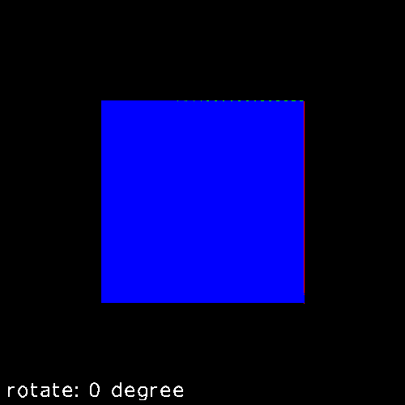

## 绕任意向量旋转

如何饶任意单位向量（u）旋转呢？可以先让这个向量旋转到某个轴上，例如x，再绕x轴旋转需要的角度,然后再旋转回去。就是说找到某个矩阵M, M乘以u，使得u与x轴重合。那么M乘以其它的点（或向量）得到的结果与旋转后的向量u，与变换前的点（或向量）与u 有一样的相对关系，即将模型的点和向量u一起变换, 再对变换后的点（或向量）进行旋转，最后将旋转后的点（或向量）通过乘以M的逆的形式变回去，则得到绕u旋转后的结果。

<!-- 
R(alpha)=M^(-1)R_x(alpha)M
-->


那么如何找出M呢？
<!--
M((u_x),(u_y),(u_z))=((1),(0),(0))
-->


M里面的9个元素都是未知的，这一个等式无法解出9个未知数，可以考虑多搞几个等式出来。如果有v,和w,使得uvw形成一组标准正交基的话，那么使v,w分别与y和z重合,那么
<!--
M((v_x),(v_y),(v_z))=((0),(1),(0))
-->

<!--
M((w_x),(w_y),(w_z))=((0),(0),(1))
-->


将上面三个等式合起来写成矩阵的形式：

<!--
M[[u_x,v_x,w_x],
[u_y,v_y,w_y],
[u_z,v_z,w_z]
]=[[1,0,0],[0,1,0],[0,0,1]]
-->


<!--
R_(uvw)=[[u_x,v_x,w_x],
[u_y,v_y,w_y],
[u_z,v_z,w_z]
]
-->


啊哈，现在只需要在等号的两边右乘$`R_{uvw}`$的逆即可得M。因为$`R_{uvw}`$是正交矩阵，所以其逆就是其转置。

<!--
M = [[u_x,u_y,u_z],
[v_x,v_y,v_z],
[w_x,w_y,w_z]
]
--->


## 执行和结果

```shell
cargo run --example=transform_arbitrary_rotation
convert -delay 10 -loop 0 output*.ppm output.gif
```


>绕（1,1,1）旋转的立方体
