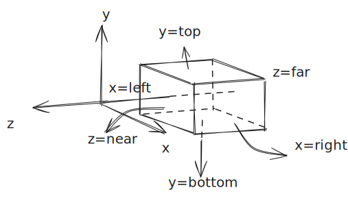
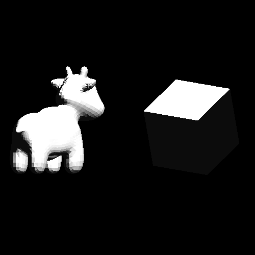

## 正交投影

视口变换（Viewport transform) 将标准立方体变换到屏幕空间。如果想渲染的不是标准立方体呢？要么，重新构造一个视口变换，要么在做视口变换前将这个”不标准的区域“变换为标准立方体。这个变换就是正交投影。想要投影的区域用六个平面围成的区域来表示：x ∈ [left,right],y ∈ [bottom,top],z ∈ [far,near]


通过一系列的平移和缩放，可以将该立方体变换到标准立方体:
1. T(-left,-bottom,-far) ，将[left,right]x[bottom,top]x[far,near]的左下角平移到了原点，既平移后的立方体为[left,right-left]x[0,top-bottom]x[0,near-far]
1. 再应用缩放 S(1/(right-left),1/(top-bottom),1/(near-far)) 得到：[0,1]x[0,1]x[0,1] 
1. 再应用缩放S(2,2,2) 得到[0,2]x[0,2]x[0,2]
1. 最后再平移T(-1,-1,-1),得到[-1,1]x[-1,1]x[-1,1]

所以，正交投影矩阵M=T(-1,-1,-1)S(2,2,2)S(1/(right-left),1/(top-bottom),1/(near-far))T(-left,-bottom,-far), 中间的两个缩放可以合并：

<!--
M=T(-1,-1,-1)S(2/(right-l​eft),2/(t​op-bo​t​t​om),2/(n​ear-far))T(-l​eft,-bo​t​t​om,-far)
-->


## 执行

```shell
cargo run --example transform_orthographic_projection
```


>通过正交投影渲染[-2,2]x[-2,2]x[-2,2]立方体内的物体
