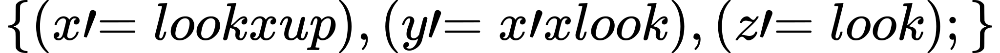
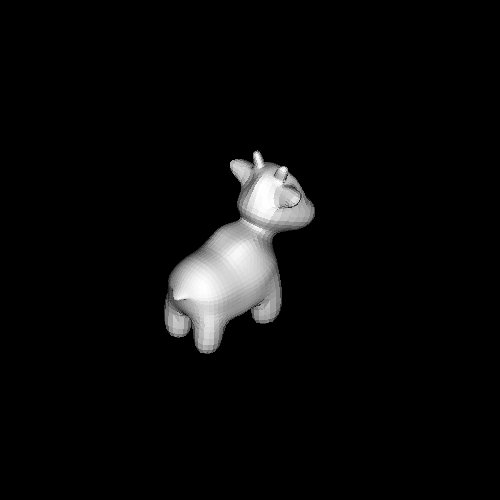
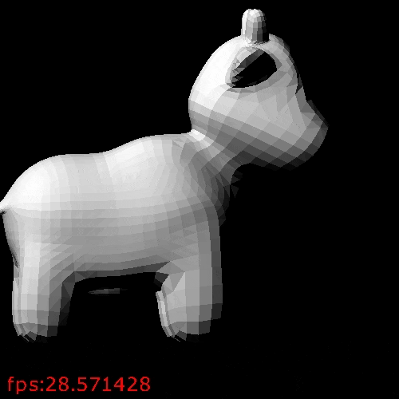

## 视图变换

视图变换，也叫相机变换，注意区别于视口变换。什么是视图变换呢？先想想，除了对模型的变换，还有什么能决定渲染的结果是什么样子的？首先，从哪个轴”看“应该是个决定性因素。前的所有例子都是从z轴往z负方向看的。对于小牛来说，如果从x轴来看，渲染的就应该是小牛的侧面，而不是牛屁股。第二是”上“方向是什么，前面的例子的上方向都是y的正方向，对于小牛而言，如果”上“方向是-y,那么渲染出来的结果就是一个四脚朝天的牛。还有就是”眼睛“（或相机）的位置在哪里，对于透视投影来将，眼睛离物体远和近投影出来的结果应该是不一样的。

将相机放在原点，相机的上为y的正方向，看向-z的方向，这就个标准的摆法，后面的透视投影就是针对这样的摆法计算的投影矩阵。对于其它的相机摆法，我们需要找到一个矩阵，用改矩阵将任意的相机摆法变换为标准摆法（这样就不用对不同的摆法求不同的透视投影矩阵了），这个矩阵就被成为视图变换矩阵。完全的变换过程为：模型变换 -> 视图变换 -> 投影变换 -> 视口变换，写成矩阵形式为：
<!--
M = M_(vp)M_(proj)M_(viewing)M_(model)
-->

>注意，上面的这些变换都是应用在模型上的。具体得说，就是在顶点Shading的过程中用上面的变换矩阵乘以顶点的坐标

>为什么相机变换可行？
>相机变换并没有实际作用在相机上，甚至相机本身在渲染管线中是不存在的，它是一个概念。因为相机变换后，模型相对与标准相机的位置和变换前模型相对相机的位置是一样的，因此渲染的结果是一样的。好比排照，人（模型）和相机一起移动后和移动前拍出来的结果是一样的（假如没有背景）。

## 求视图变换矩阵

给出相机位置(e)，看向的方向（looking)，和上方向(up)，就可以计算出一个矩阵, 应用该矩阵可以得到一个标准摆放的相机。这里先假设look和up是正交的单位向量,用look叉乘up得到一个向量，记为x',那么look up 和x'  三个向量两两正交。 要将相机变换成标准摆放，先用一个平移将e移动到原点(T(-e)),再通过一个变换使up与y重合，looking与-z重合，x' 与x重合:
<!--
{(Mup=y),(Mlo​oki​ng=-z),(Mx'=x):}
-->

<!--
M[[x'_x,up_x,lo​oki​ng_x ],
[x'_y,up_y,lo​oki​ng_y ],
[x'_z,up_z,lo​oki​ng_z ]
] = [[1,0,0],[0,1,0],[0,0,-1]]
-->


和前面的绕任意向量旋转类似，up,looking,x'是两两正交的单位向量，因此矩阵[x',up,looking]，是个正交矩阵，其逆为其转置。
<!--
M = [[1,0,0],[0,1,0],[0,0,-1]][
[x'_x,x'_y,x'_z],
[up_x,up_y,up_z],
[lo​oki​ng_x,lo​oki​ng_y,lo​oki​ng_z]
]
-->

<!--
M = [
[x'_x,x'_y,x'_z],
[up_x,up_y,up_z],
[-lo​oki​ng_x,-lo​oki​ng_y,-lo​oki​ng_z]
]
-->

则视图变换矩阵为MT(-e)

相机在原点，上方向为y,看向-x,情况下渲染的结果如下，
```rust

let c1 = camera1(
  Vec3::new(0., 1., 0.), // up
  Vec3::new(-1., 0., 0.), // looking
  Vec3::new(0., 0., 0.), // e
);
```

```shell
cargo run --example transform_viewing -- c1
```

相机在原点，上方向为-y,看向-x,情况下渲染的结果如下，
```rust

let c2 = camera1(
  Vec3::new(0., -1., 0.), // up
  Vec3::new(-1., 0., 0.), // looking
  Vec3::new(0., 0., 0.), // e
);
```

```shell
cargo run --example transform_viewing -- c2
```

### 如果up和look不正交

如果up和look不正交，那么将 x' up look 变换到xyz不是一个简单的旋转，[x',up,look]的逆也不是简单的转置就能得到的。变换后的up 和look 变得正交，以此模型经过同样的变换后就会变形。因此如果up和look不正交，就不能直接使用它们。而是要从它们出发构建一个正交的基。
<!--
{(x'=lo​ok x up),(y'=x' x lo​ok),(z'=lo​ok);}
-->


y' 做为新的上方向，和原来的up大致一致。z' 做为新的look和原来look一样。为什么不用look 叉 x' 来做新的上方向呢？因为那样就和原来的上方向差的太远了.

```rust

let c2 = camera2(
  Vec3::new(0., 1., 0.), // up
  Vec3::new(-1., -1., -1.), // looking
  Vec3::new(0., 0., 0.), // e
);
```

```
cargo run --example transform_viewing -- c3
```

直接给出一个向量来表示看向的方向，有时候可能不太直观，因此在API的设计上，可以指定上方向，位置，和看向哪个点，那么看向的方向就是看向的点减去位置。

相机绕y旋转的例子：

