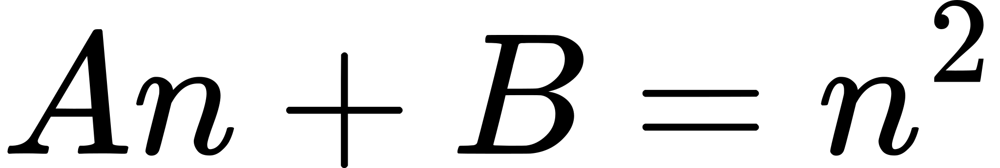

## 透视投影

透视投影可以实现近大远小的效果。Games 101 里面将的很清楚，透视投影分两步：
1. 先将一个截锥体(frustum,下图左边）变换成一个立方体
1. 再对上面的立方体做一次正交投影，变成标准立方体 
截锥体

>图来自：Fundamentals of Computer Graphics 4th Edition

截锥体较小的那个面更靠近相机，是为近平面，其对面的面更远离相机，是远平面。可以想象，当远平面被“挤压”到近平面的大小之后，远处的模型就会跟着变小。

### 变换过程中的x,y如何变化

x,y 的大小正比于1/n, 也就是说随着z变大，相同的x,y会变的更小。由相似三角形的比例关系可以比较方便的计算出变换后的x与y,分别记做x'y'，与x,y,n,z之间的关系。n为近平面（z=n处）。


>图来自：Fundamentals of Computer Graphics 4th Edition

xoy剖面：

>图来自：Games 101 Lecture 04

因为尚不知z如何变换，所以先用？代替。
<!--
M((x),(y),(z),(1)) = (((n/z)x),((n/z)y),(?),(1))
=[[n/z,0,0,0],[0,n/z,0,0],[?,?,?,?],[0,0,0,1]]((x),(y),(z),(1))
-->


但z不是一个常量，因此不能出现再矩阵中，因为为们用的齐次坐标，(nx/z,ny/z,?,1) 与(nx,ny,?,z)表示的是同一个点，因此，我们可以用后者来去掉矩阵中的z,另外，z如何变化应该是和x与y没关的：

<!--
[[n,0,0,0],[0,n,0,0],[0,0,?,?],[0,0,1,0]]((x),(y),(z),(1))
=((nx),(ny),(?),(z))
-->


>注意矩阵最后一行的变化


### 变换过程中z如何变化

z 在渲染过程中的作用是用来决定顶点的深度的，使各个片元被正确的渲染。因此z只需要保持相对大小不变即可。

那么是否可以这样指定z的变换呢：
<!-- 
[[n,0,0,0],[0,n,0,0],[0,0,0,n],[0,0,1,0]]((x),(y),(z),(1))
=((nx),(ny),(n),(z))~((n/zx),(n/zy),(n/z),(1))
-->


用这个矩阵变换的效果如下：


在这里看起来是可以的，但实际上会有问题。问题是z不仅仅是用来决定深度，还会用来剪切掉frustum之外的东西。上面这个变换会改变近平面和远平面的z值，也就是说会导致该被渲染的东西未被渲染出来。

为了解决这个问题，可以约定近平面和远平面上的点变换后z值不变。
<!--

[[n,0,0,0],[0,n,0,0],[0,0,A,B],[0,0,1,0]]((x),(y),(z),(1))
=((nx),(ny),(Az+B),(z))
-->


对于近平面z=n有：
<!--
An+B = n^2
-->


对于远平面z=f有：

<!--
Af+B = f^2
-->


接这两个方程得：
<!--
{(A=n+f),(B=-nf):}
-->


所以，从frustum到立方体的变换矩阵为：
<!--
[[n,0,0,0],[0,n,0,0],[0,0,n+f,-nf],[0,0,1,0]]
-->


<!--
[[n,0,0,0],[0,n,0,0],[0,0,n+f,-nf],[0,0,1,0]]((x),(y),(z),(1))
=((nx),(ny),((n+f)z-nf),(z))~((n/zx),(n/zy),(n+f-(nf)/z),(1))
-->
应用该矩阵到某点：


对z的变换满足：
1. 相对大小不变
1. 近、远平面z不变


那么完整的透视投影矩阵为：
<!--
Ortho(l,r,b,t,f,n)
[[n,0,0,0],[0,n,0,0],[0,0,n+f,-nf],[0,0,1,0]]
-->


其中Ortho表示正交投影变换矩阵，l,r,b,t,f,n分别表示左、右、下、上、远、近平面

```rust

fn perspective(left: f32, right: f32, bottom: f32, top: f32, far: f32, near: f32) -> Mat4 {
  #[rustfmt::skip]
    let m = Mat4([
      near, 0.,  0.,  0.,
      0.,near ,  0.,  0.,
      0.,0.,  near+far ,-far*near,
      0.,0.,  1.,  0.
    ]);
  &transform::orthographic(left, right, bottom, top, far, near) * &m
}

```

### fov

用6个平面的方式指定透视投影的截锥体并不是很方便，业内实践上常用的方式是视野（field of view，fov）、宽高比、以及近远平面来指定。

视野指的是垂直（或水平）的可视角度是多少，这里用垂直视野。根据这个角度可以通过三角函数求出高，通过高可以得到top和bottom，通过高和宽高比可以求的left,right.

不同的fov渲染结果对比：

```shell
cargo run --example transform_perspective_fov
```


