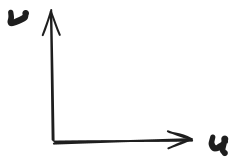
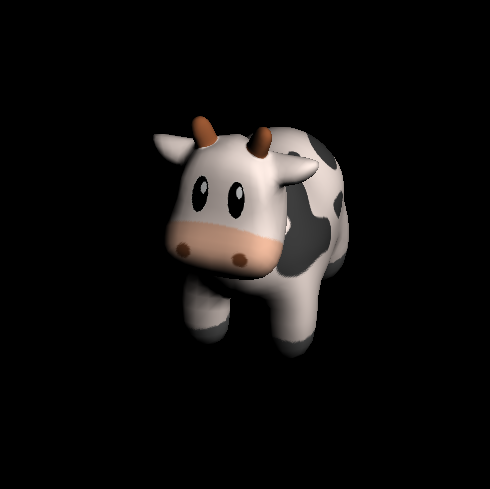

## 什么是纹理

纹理是一张图，可用用来“贴”在模型上面（当然纹理的作用不仅仅是用来贴在模型上）。一般纹理的坐标用uv为来表示，如下图：



u和v的范围在0到1之间。

## 如何将纹理贴到模型上

模型里面可能会有纹理坐标信息，即为每个顶点指定了其纹理坐标。在贴图的时候根据三个顶点的纹理坐标，通过三角形的重心坐标插值就可以得到每个片元的纹理坐标，有了这个纹理坐标就可以从纹理中获取这个片元的颜色。

```rust
impl<'a> Shader for MyShader<'a> {
  fn vertext(&mut self, model: &Model, face: usize, nth_vert: usize) -> Vec3<f32> {
    let normal = model.normal(face, nth_vert);
    // 从模型中获取该顶点的纹理坐标
    let uv = model.texture_coord(face, nth_vert);
    self.varying_normals[nth_vert] = &self.invert_transpose * &normal;
    self.varying_uvs[nth_vert] = uv;
    let v = model.vert(face, nth_vert);
    &self.mat * &v
  }

  fn fragment(
    &self,
    // 此点坐标
    pos: Vec3<f32>,
    // 此点处的质心坐标
    bar: Vec3<f32>,
  ) -> Fragment {
    let normal = (self.varying_normals[0] * bar.x
      + self.varying_normals[1] * bar.y
      + self.varying_normals[2] * bar.z)
      .normalize();
    let i = (normal * Vec3::new(1., 1., 0.).normalize()).max(0.);

    // 通过对顶点纹理坐标插值，得到该点的纹理坐标
    let uv =
      self.varying_uvs[0] * bar.x + self.varying_uvs[1] * bar.y + self.varying_uvs[2] * bar.z;
    let color = self.texture.get_vec3f(uv.x, uv.y) // 用texture做为该点的颜色
        * i; // 乘以此处光的强度
    Fragment::Color(color)
  }
}

```

```shell
cargo run --example texture_diffuse --release
```



## 会有什么问题

当纹理相对与渲染的结果太大或太小都会有问题。

虽然纹理坐标在0到1之间，但图片的像素坐标是整数，因此在通过uv坐标访问像素的时候需要乘以图片的宽高，得到的结果自然几乎都是小数，最简单的做法就是对小数进行舍入。那么当纹理太小的时候，那么纹理就会被“拉大”，因为对坐标进行了舍入，会导致渲染结果相邻的地方出现颜色的突变，从而出现马赛克。

当纹理太大的时候，一个渲染的点就会覆盖较大的一片纹理，如果这片纹理的变化比较丰富就会出现摩尔纹（aliasing,走样）。
