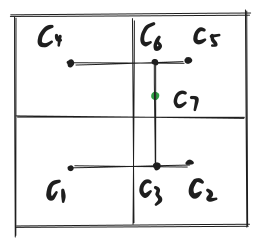

## 双线性插值

为了让像素和像素之间过度更加平滑，对于非整数是位置可以通过插值来计算出一个颜色，而非取靠的最近的像素。双线性插值指的是在水平和垂直两个方向进行线性插值，而不是做了两次线性插值计算。实际上，双线性插值做了三次插值计算。
什么是线性插值呢，线性插值就是假如你有两个值，你希望计算这两个值之间均匀变化的值。
<!--
i\nterpolate(alpha,A,B)=A + alpha(B-A)
-->

这样，当alpha从0变到1,interpolate(alpha,A,B) 就均匀的从A变到B.

在下图中，绿色点是要计算颜色的位置，c1,c2,c4,c5是四个像素。c3是由c1,c2插值得到，这时alpha为绿点的u坐标-c1的u坐标。c6是由c4,c5插值得到，c7由c3和c6插值得到。

## 对比

|Tuncate|Bilinear|
--|--
|
cargo run --example texture_mosiac|cargo run --example texture_bilinear
