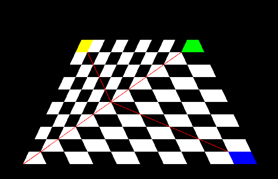
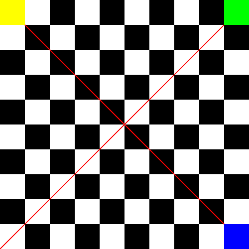
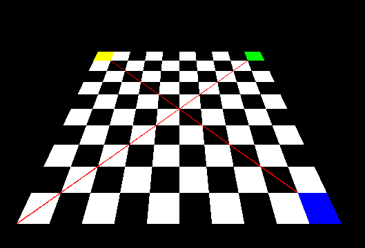

## 透视插值矫正

到[目前](https://github.com/JunYang-tes/yatsr/tree/630cdcb1bac78298a39e4e18750bdf89d1ada013),我们的重心坐标是基于屏幕空间（也就是经过了所有变换）坐标来计算的，因此，基于重心坐标的插值也是基于屏幕空间坐标得到的。在透视投影的情况下得到的结果就可能不对。例如
：


>cargo run --example texture_perspective

这个zox平面上的一个矩形，相机位于（0,1.5,1.5）处,看向-z,以y为上方向的透视渲染结果图。其中应用到的纹理如下：



>其左上角的的uv坐标为（0,1）

根据我们日常生活的经验，这个渲染结果显然是不对的，这些格子应该有近大远小的关系。纹理图片中的两条红线为对角线，其中一条看起来像被折断了一样，这也显然是不对的。为什么会这样呢？这是因为在计算纹理坐标的时候用的重心坐标是屏幕空间的坐标系。在渲染左上角的三角的斜边的中点的时候，计算出来的纹理坐标为（0.5,0.5），即纹理的中心，而在正确的渲染结果中,纹理的中心位置应该为应用到更靠右靠上的地方。

## 通过逆矩阵在片元着色代码里计算重心坐标

我们可以通过在Shader里保留三个原始的顶点（定点的世界坐标），并且在片元的着色代码里基于世界坐标来计算重心坐标，从而插值得到uv坐标。
```rust
impl<M: Model> Shader<M> for MyShader {
  fn vertext(&mut self, model: &M, face: usize, nth_vert: usize) -> Vec3<f32> {
    self.varying_uvs[nth_vert] = model.texture_coord(face, nth_vert);
    // 保存顶点坐标
    self.varying_verts[nth_vert] = model.vert(face, nth_vert);
    &self.mat * &model.vert(face, nth_vert)
  }

  fn fragment(
    &self,
    // 此点坐标
    pos: Vec3<f32>,
    // 此点处的质心坐标
    bar: Vec3<f32>,
  ) -> Fragment {
    //pos，为该片元的屏幕坐标， 通过逆矩阵计算该片元的世界坐标
    let p = &self.mat.invert() * &pos;
    // 基于世界坐标计算重心坐标
    let (a, b, c) = yatsr::pipeline::barycentric(
      self.varying_verts[0],
      self.varying_verts[1],
      self.varying_verts[2],
      p.x,
      p.y,
    );
    // 通过顶点的uv坐标以及重心坐标来计算该点的uv坐标
    let uv = self.varying_uvs[0] * a + self.varying_uvs[1] * b + self.varying_uvs[2] * c;
    Fragment::Color(self.texture.get_vec3f(uv.x, uv.y))
  }
}
```



## 在栅格化三角形的时候计算重心坐标


```diff
5d4
<   pipeline::Fragment,
7a7,12
> pub enum Fragment {
>   Discard,
>   Color(Vec3<f32>),
>   Rgba(Vec4<f32>),
> }
> 
10c15
<   fn vertext(&mut self, model: &M, face: usize, nth_vert: usize) -> Vec4<f32>;
---
>   fn vertext(&mut self, model: &M, face: usize, nth_vert: usize) -> Vec3<f32>;
21c26
< type Point = Vec4<f32>;
---
> type Point = Vec3<f32>;
34,36c39,41
<   a: Vec4<f32>,
<   b: Vec4<f32>,
<   c: Vec4<f32>,
---
>   a: Point,
>   b: Point,
>   c: Point,
40,45d44
<   let wa = a.w;
<   let wb = b.w;
<   let wc = c.w;
<   let a = a.to_3d_point();
<   let b = b.to_3d_point();
<   let c = c.to_3d_point();
51d49
< 
63,64c61
<           let k = 1. / (alpha / wa + beta / wb + gamma / wc);
<           match shader.fragment(p, Vec3::new(alpha / wa / k, beta / wb / k, gamma / wc / k)) {
---
>           match shader.fragment(p, Vec3::new(alpha, beta, gamma)) {
96d92
<         let k = 1. / wa * alpha + 1. / wb * beta + 1. / wc * gamma;
99c95
<           match shader.fragment(p, Vec3::new(alpha / wa / k, beta / wb / k, gamma / wc / k)) {
---
>           match shader.fragment(p, Vec3::new(alpha, beta, gamma)) {


```
