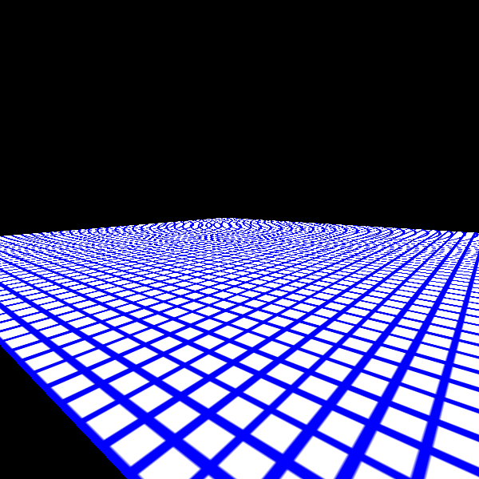
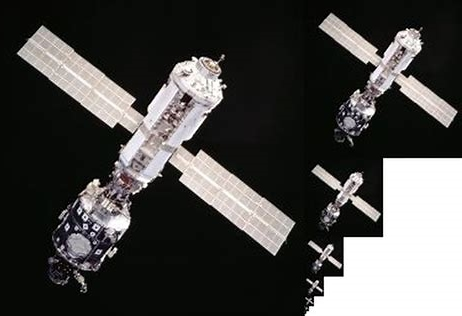
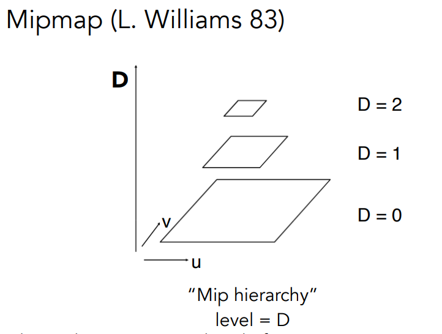
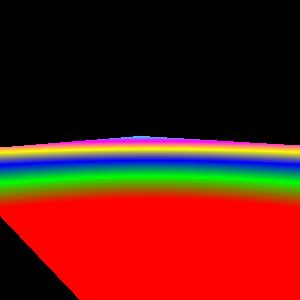
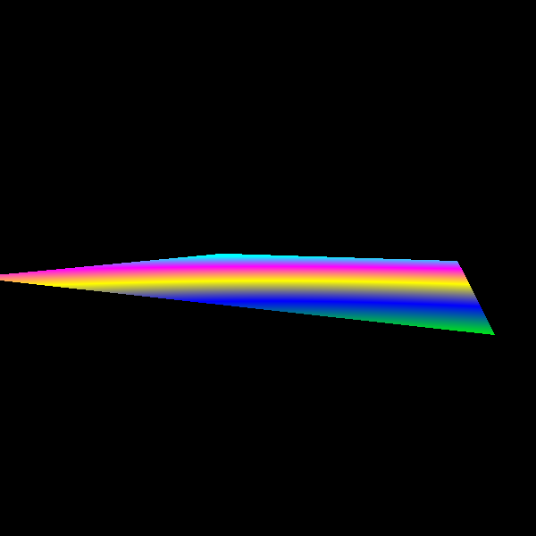
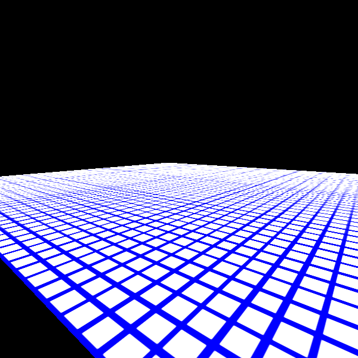

## 走样

在透视投影中，“远处”的一个像素，相对于“近处”的一个像素，代表了一个更大的区域,因此其对应的纹理也应该是一个较大的区域。这时候如果还是用一个纹理上的像素来着色该点，就可能会失真。就像下面绘制的平面一样，远处可看见明显的摩尔纹。



## Mipmap

改善的方式是计算每个像素影射到纹理空间所覆盖的那个区域的所有纹素的平均值，但这是一种开销大的做法。另一种做法就就是生成一系列的纹理，这些纹理的宽高减半直到纹理的大小变成1x1为止，这样远的地方就可以使用小的纹理，近的地方就使用大一些的纹理。这种纹理影射的方式就被称为mipmap影射。这一系列的纹理，按从大到小的顺序排列，也被称为图像金字塔。





在着色的过程中，计算相邻两个屏幕像素影射到纹理空间之后有多大的差别来决定使用那个级别的纹理。假如投影后的纹理相差一个像素的距离，说明一个屏幕像素覆盖了一个纹素，那么就该使用D=0的纹理。如果相差2个像素的距离，说明一个屏幕像素覆盖了4个纹素，那么就就该使用原始纹理1/4大小的纹理，即使用D=1的纹理。以此类推，可知纹理层次D和投影后两个像素的距离L之间的关系为D=Log2(L)

计算出来的D如果是个小数，那么就在D的上下两层的纹理里面取得颜色后做个线性插值。

```
let c1 = mipmap.color(D.floor(),u,v);
let c2 = mipmap.color(D.ceil(),u,v);
let color = interp(D-D.floor(),c1,c2);
```

因为在计算D的过程中需要计算相邻点的uv坐标，所以在[mipmap.rs](./mipmap.rs)中我们将顶点保存在了shader中。在webgl中这是不必要的，因为webgl会帮我们计算需要的级别。

如果我们分别用红、绿、蓝、黄、紫、青表示第0、1、2、3、4、5层纹理来渲染一个透视投影的平面，来观察不同远近处的屏幕像素影射到了哪一层纹理，我们会得到下面的结果：

|较近|较远|
|-|-|
||
|相机位于(0.9, 0.2, 1.1)|相机位于(0.9, 0.2, 1.8)|

>cargo run --example texture_mipmap -- color

应用mipmap 渲染的结果：



>cargo run --example texture_mipmap -- grid


