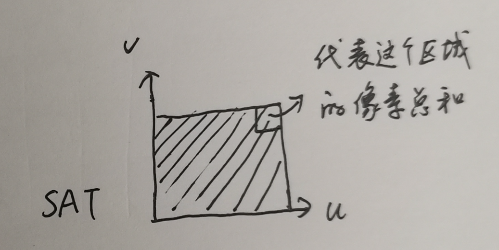

## 各向异性过滤（anisotropic filter)

屏幕像素影射到纹理空间后往往不再是个正方形而是个四边形。但Mipmap是用一个正方形的区域来来近似这个四边形，如果它们之间的差异较大，就会导致渲染的结果比较模糊。各向异性过滤就是为了解决这个问题而发明的。各向异性这个术语中的各向只的是各个方向，异性指的是不同的。filter 通常翻译成过滤或滤波，在这个语境下，愚以为可以简单理解为用小的区域来近似大的区域（以及相反）的方式。比如“最近（Nearest）”、“双线性插值（Bilinear Interpolate）、“区域平均值”这些都是filter。

下面的表格展示了两种各项异性过滤的具体实现：Summed-Aread Table (SAT,个人翻译：预求和表) 和Unconstrained anisotropic filter (个人翻译：完全各向异性)。

对比下表，可以发现“完全各项异性”的效果最好，SAT的效果次之。

|||
--|--
aliasing|mipmap|
|
SAT|unconstrained|
|
cargo run --example texture_sat | cargo run --example texture_unconstrained

## SAT 原理和实现

>图来自《Real-Time Rendering》展示了屏幕空间的一个像素影射到纹理空间可能的样子（红色矩形）。

上图左边的红色正方形代表了一个像素，右边的红色矩形代表了坐标的红色正方形影射到纹理空间所覆盖的区域，这个区域有一个名字叫做“footprint”

SAT的原理是用footprint的包围盒的平均颜色来近似footprint所覆盖的区域的平均颜色。由此可知，footprint与包围盒越重合，渲染效果越好。对于footprint是其包围盒的对角线的情况，也会造成模糊。

该算法使用了一个预先计算的“区域纹素（纹理上的像素）和” ，即SAT，的二维数组来快速计算包围盒的平均颜色。

>阴影区域代表了一个二维数组，左下角为[0,0]处，右上角代表了这整个区域的纹理像素总和。

下图左侧是一个3x3 的纹理，右侧是其对应的SAT：

如果包围盒由左下角和右上角两个点的坐标给出，分别为(x1,y1),(x2,y2), S(x1,y1) 表示矩形(0,0) (x1,y1) 所覆盖的区域的像素总和，那么矩形(x1,y1) (x2,y2)所覆盖区域的像素总和为：S(x2,y2) - S(x1,y2) - S(x2,y2) + S(x1,y1). 这个像素和在除以总像素数就是要求的平均颜色。总像素个数等于包围盒的面积，因此也是直接计算就可以得到。

### SAT 的构建

可以按从下到上，从左到右的顺序来构造这个SAT。如下图，在计算右上角的值的时候，a，b,c 三个区域的值已经计算了。一次右上角的值等于a+b-c+对应位置的纹素值。对于最左边（col==0）以及最下边（row==0）这两个边界情况，可以单独处理，也可以假想在最左边的左边添上一列0,最下边的下边添上一行0。

代码见[sat.rs (fn new)](./sat.rs#L8)

## 一种完全各向异性过滤的原理和实现

利用Mipmap多次采样然后用其平均值来作为footprint区域的颜色会得到不错的渲染效果。具体来讲，就是计算footprint的最短边和最长边，用最短边的长度来计算Mipmap所需要的级别（level），用最长边除以最短边来决定采用的次数。用若干个正方形来覆盖这个footprint。

上图中的a、b、c、d是footprint的四个顶点的uv坐标，绿色箭头是采样方向。图中左边部分大概会采样四次，右边部分采样两次。采样点的uv坐标可以用直线的向量表示来求,即 p(t) = p + t*v, 其中p是直线上的一点，v是直线的方向向量，t是参数。ab的中点m，cd的中点n容易求得。v=(n-m).normalize(), l表示长边的长度，c表示采样的次数，i从0到c,那么下面的公式会计算出下图中的黄色采样点的uv坐标。

<!-- 
p(i) = m + i*(l/c)*v
-->

为了结果更准确，可以把m点先沿v移动(l/2c)那么多,即s=m+(1/2c)v:
<!-- 
p(i) = s + i*(l/c)*v
-->

代码见[unconstrained.rs (fn get)](./unconstrained.rs#L38)

