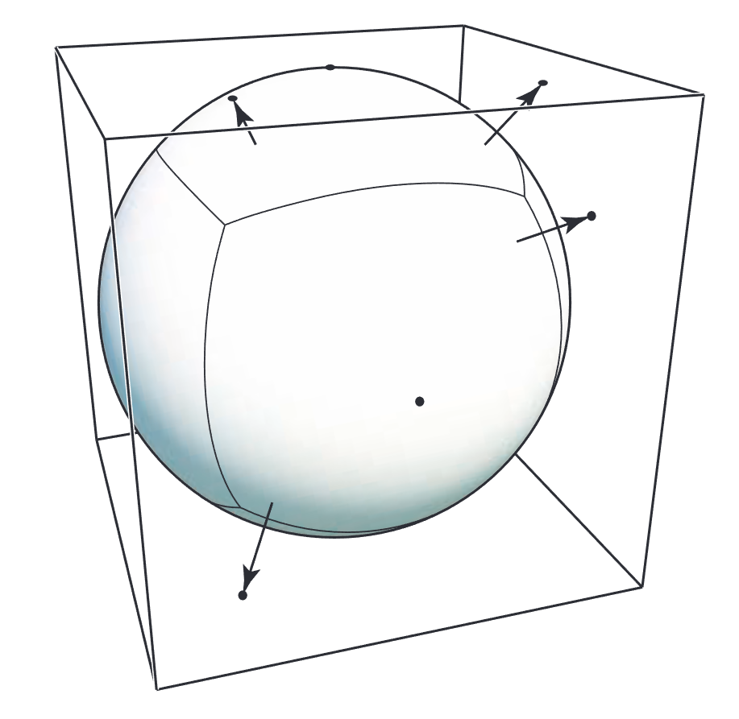
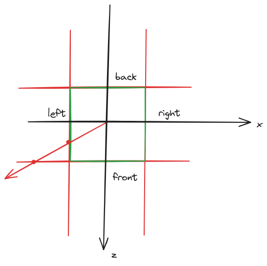
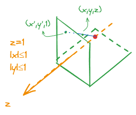
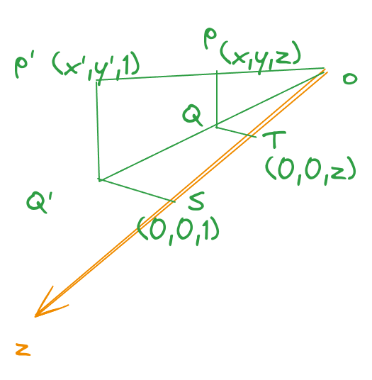
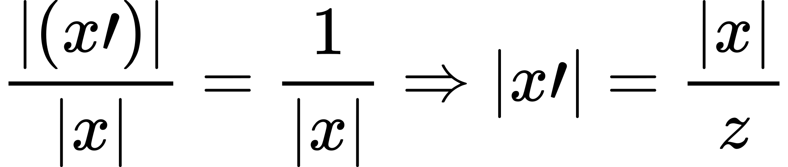
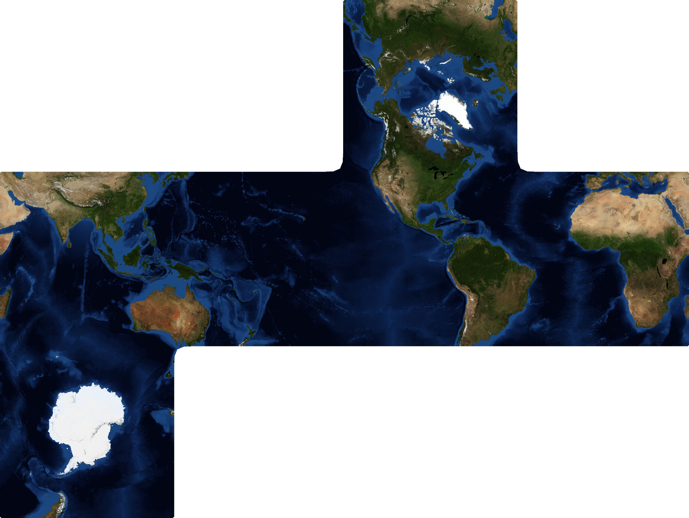
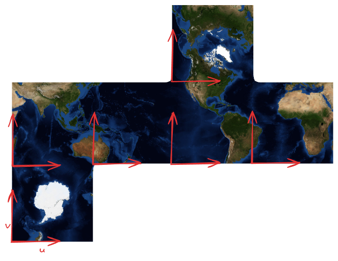
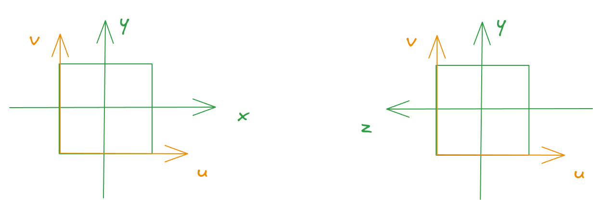
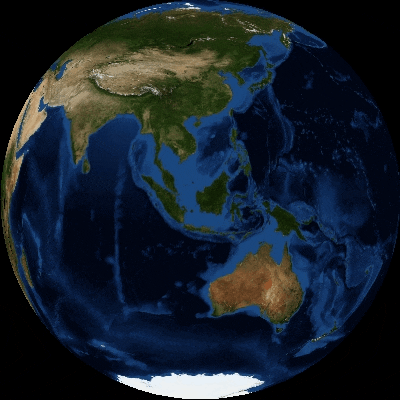
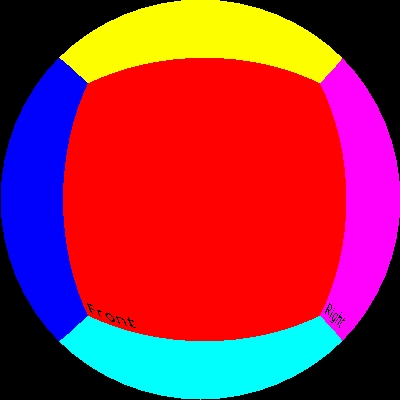

## Cubemap

将模型表面的点投影到它的标准立方体的六个表面上而形成的纹理影射方式叫做cubemap。



## 计算投影点坐标


模型上的点（例如p点）投影到标准立方体上的方法是以原点为起点做一条过p点的射线，射线和立方体的交点既为投影的点（p')。根据这个定义很自然的得出下面的纹理查询方法：

```rust
let cube = [
  // 由一个点和一个法向量定义平面
  (Vec3::new(0., 0., 1.), Vec3::new(0., 0., 1.)), // front
  (Vec3::new(-1., -1., -1.), Vec3::new(0., 0., -1.)), // back
  (Vec3::new(-1., -1., 1.), Vec3::new(-1., 0., 0.)), // left
  (Vec3::new(1., -1., 1.), Vec3::new(1., 0., 0.)), // right
  (Vec3::new(1., 1., 1.), Vec3::new(0., 1., 0.)), // top
  (Vec3::new(1., -1., 1.), Vec3::new(0., -1., 0.)), // bottom
];
for (ind, (p, normal)) in cube.iter().enumerate() {
  // 计算射线和当前遍历到的平面的交点，射线由射线上的点以及方向向量定义：
  let p = get_intersect(
    *p,
    *normal,
    Vec3::new(0., 0., 0.), // 射线起点
    point,                 // 射线方向 point - Vec3::new(0.,0.,0.), 不需要归一化
  );
  // 如果射线和当前平面没有交点，p为None
  if let Some(p) = p {
    // 因为求的是射线和“平面”的交点，而非射线与立方体的面的交点，见下图，所以要
    // 判断下交点是否在立方体的当前面上。
    if p.x >= -1. && p.x <= 1. && p.y >= -1. && p.y <= 1. && p.z >= -1. && p.z <= 1. {
      return match ind {
        // 将交点的xyz坐标转换成纹理的UV坐标，后面再说
        0 => self.texture[ind].get((p.x + 1.) / 2., (p.y + 1.) / 2.),
        1 => self.texture[ind].get((-p.x + 1.) / 2., (p.y + 1.) / 2.),
        2 => self.texture[ind].get((p.z + 1.) / 2., (p.y + 1.) / 2.),
        // right
        3 => self.texture[ind].get((-p.z + 1.) / 2., (p.y + 1.) / 2.),
        // top
        4 => self.texture[ind].get((-p.x + 1.) / 2., (p.z + 1.) / 2.),
        _ => self.texture[ind].get((p.x + 1.) / 2., (p.z + 1.) / 2.),
      };
    }
  }
}
```

>从y正方向为-y方向俯视，某射线和left与front两个面有交点，但是只有left面上的交点才是我们想要的交点

## 计算量更小的投影点坐标计算方式

除了这个方法，还有一种更简单的方式来求射线和立方体面的交点。假设我看考虑一个点p(x,y,z)被投影到了z=1 这个平面上，为p'(x',y',z'), 那么z' = 1, 如下图：



过p'做垂线垂直与xoz平面（y=0平面）垂点为Q'，过p做垂线垂直与xoz平面（y=0平面）垂点为Q。过Q'做垂线垂直与z，垂点S,过Q做垂线垂直与z，垂点T:



OQT 与OQ'S 是相似三角形,|x|表示QT的长度：
<!-- 
|(x')|/|x| = 1/|x| => |x'| = |x|/z
-->


因为x' 与x同号，所与 x' = x/z。OQ' = sqrt((x')^2+1), OQ=sqrt(z^2),求得 y'=y/z.

上面的讨论是假设z>0的，如果z<0, 则p会投影到z=-1 这个平面上，投影点为(x/-z,y/-z,-1).因此，一个点如果投影到z=1或z=-1上，那么投影点的x,y坐标为(x/|z|,y/|z). 类比可以得到投影到x=1和x=-1平面上的坐标为(y/|x|,z/|x|),投影到y=1和y=-1平面上的坐标为(x/|y|,z/|y|).

## 如何确定投影到了立方体的哪个面上

看点的坐标中决定值最大的是哪个分量，如果最大的是x,则会投影的左面或右面;如果最大的是y,则会投影到上或下;如果最大是z,则会投影到前或后面上。再最绝对值最大的量的正负，如果是正则对应地投影到前、右或上面;如果是负则对应的投到后、左或下面。例如p(x,y,z) 投影到z=1,得(x/z,y/z),如果z不比x,y大，那么x/z就大于1或小于-1,那么就不在正面的正方形区域内了。

## 将投影点坐标转换为纹理坐标

cubemap里面包含了六个纹理图片。这六个纹理往往被拼接存储到一个图片中。比如：



如何将投影点坐标转换为uv坐标取决与我们如何把立方体分开，以及如何约定纹理图片上的哪个区域对应了立方体的哪个面。

我们这里按下图约定各个面以及展开方式:


每个小区域有自己的uv坐标，uv原点在每个小区域的左下角，u向右，v向上。



下图左半边是投影到z=1平面上的示意图，右半部分是投影到x=1的示例图。


当投影到z=1平面时，u = (x+1)/2, v = (y+1)/2, 即将x和y从[-1,1] 映射到[0,1]即可.

当投影到x=1平面的时候，需要将z从[-1,1] 映射到[0,1]做为u：
u = (-z + 1)/2, 将y从[-1,1] 映射到[0,1] 做v：v = (y+1)/2

其它几个面类似可得。

## 结果

|||
|-|-|
|||
|cargo run --example texture_cubemap --release|cargo run --example texture_cubemap --release color-cube|
