## 什么是凹凸贴图(Bump Mapping)

凹凸贴图是一中在不改变几何形状的情况下实现凹凸感的一种技术。凹凸感由明暗的变换来营造，因此对片元的法向量进行扰动，导致原本的光影改变从而达到实现凹凸不平的感觉。

例如下图，原本只是一个平面（xoy平面），但是在片元着色代码中，以当前片元的坐标为终点，原点为起点的方向做了该片元的法向量而绘制出来的效果，就好像中心有一个尖的突起似的。

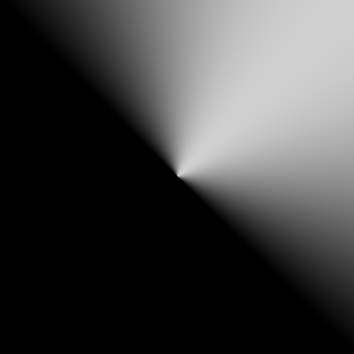
>cargo run --example texture_bumpmap_a

## 法线贴图

法线贴图是实现凹凸贴图的方法之一。是指将片元的法线存储在纹理中，在需要用到片元法向量的地方再从纹理中读取。最直接的方式就是把扰动后的法向量坐标(世界坐标)从[-1,1]（法向量的每个分量都在-1到1之间）映射到[0,1]（或者说是[0,255]）范围，然后存入纹理。读取的时候做一个反向的操作就得到了片元的法向量。

|用模型里的法向量进行Gouraud Shading|用纹理里的法向量进行Gouraud Shading|纹理
|--|--|--|
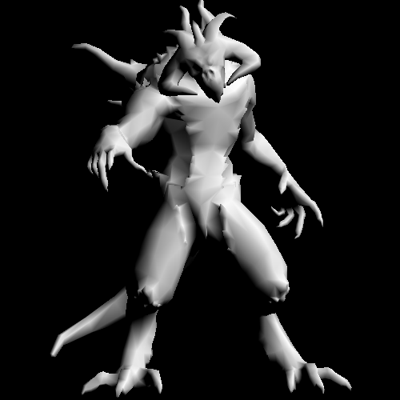|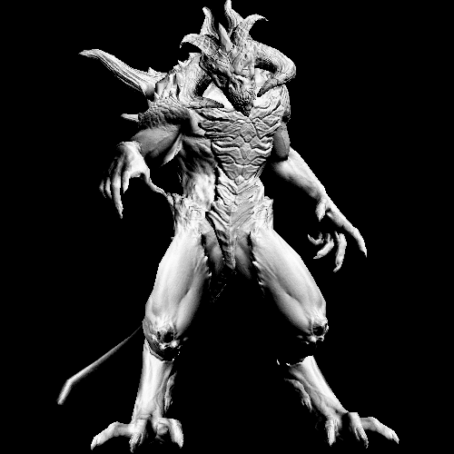|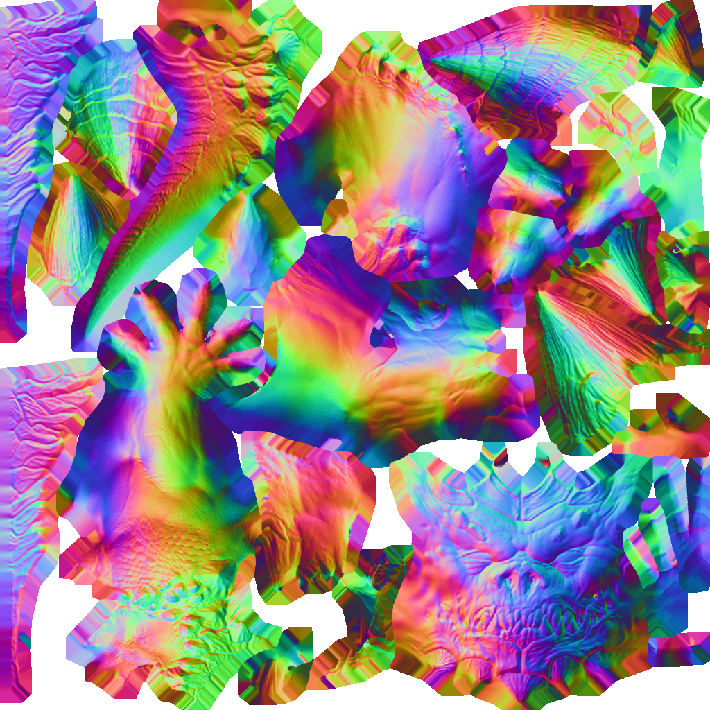
|cargo run --example texture_bumpmap_normal |cargo run --example texture_bumpmap_normal texture

```rust

fn normal_from_texture(shader: &MyShader, info: pipeline2::FragmentInfo) -> Fragment {
  let uv = info.barycentric_interpolate(&shader.varying_uv);
// 从纹理中读取改点处的法向量，因为像素的颜色范围是[0,1],所以将其乘2减1,得到[-1,1]这个范围的值。
  let normal = shader.normal_texture.get(uv.x, uv.y) * 2. - Vec3::new(1., 1., 1.);
  let light = Vec3::new(1., 1., 1.).normalize();
// 求法向量于方向光之间的余弦值，夹角越小该点越亮
  let i = (normal * light).max(0.);
  Fragment::Color(Vec3::new(1., 1., 1.) * i)
}

```

直接将法向量的世界坐标村子纹理里面的优势是读取的时候比较简单，缺点是对模型做了变换后需要对法向量做相应的变换。这种方式在实际的开发中并不常用，常用的方式是再纹理里存放的**切空间**坐标。切空间是指由某点处的**两个切向量（T，B）**以及该点的**法向量（N)**，由这三个向量构成的基向量形成的空间。这三个向量当然不比是相互正交，也不必是标准向量，只要读取纹理和生成纹理的约定一致即可。所谓“存放切空间的坐标”什么意思呢？T，B,N三个向量不共线的（两两不平行，线性无关，看你怎么称呼），那么扰动过的法向量可以表示成N1 = aT + bB + CN,那么（a,b,c）就是N1在T,B,N形成的空间里面的坐标，纹理里面存的就是这个东西。
<!--
T=(T_x,T_y,T_z)，
B=(B_x,B_y,B_z)以及 
N=(N_x,N_y,N_z)
-->
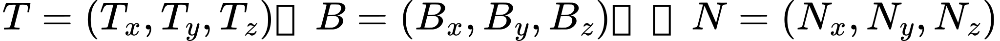
<!-- 
N1 =a*((T_x),(T_y),(T_z)) + b*((B_x),(B_y),(B_z))+c*((N_x),(N_y),(N_z))
=[[T_x,B_x,N_x],[T_y,B_y,N_y],[T_z,B_z,N_z]]((a),(b),(c))
-->
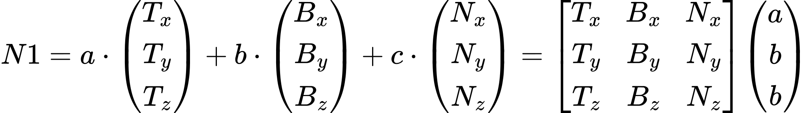

在着色的过程中纹理里得到了(a,b,c),将起乘以上面公式里的矩阵就得到了世界坐标下的N1
。世界空间中的向量乘以上面的矩阵的逆，就可以得到切空间下面的向量。我们可以选择在世界空间中处理，也可以选择在切空间中处理，只要参与计算的各个量都是在同一个空间就可以了。

实际上，利用向量叉乘，只需要一个切向量（t）就可以和法向量（N)一起构建一个切空间：T= t x N, B = T x N 。

**计算切向量**

>个人理解，可能有误


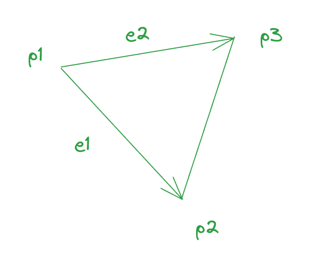

p1,p2,p3是三角形的三个顶点，它们所在的空间平面上有一对不共线的向量T,B,那么向量
e1和e2 都能够用这两个向量的线性组合表示出来：

<!--
e1=a*T + b*B ，e2=c*T + d*B
-->
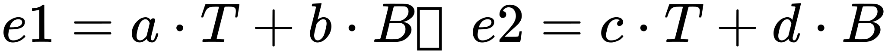

这里面e1,e2是已知，先假设a,b,c,d 也是已知，为了求T和B,可重写成矩阵形式：
<!--
((e1),(e2))=[[a,b],[c,d]]((T^T),(B^T))
-->
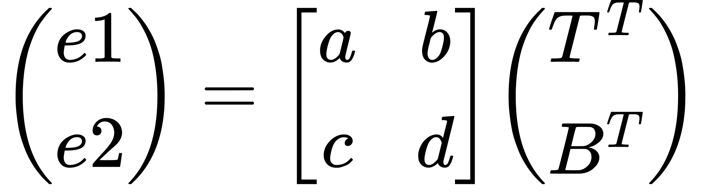

其中$`B^T$`表示行向量，两边乘以矩阵的逆：

```math
\begin{bmatrix}
a & b \\
c & d \\
\end{bmatrix}^{-1}
\begin{pmatrix}
e1 \\
e2
\end{pmatrix}
=
\begin{pmatrix}
T^T \\
B^T
\end{pmatrix}
```

二阶矩阵的逆矩阵为：主对角线交换位置，副对角线上变号，再除以其行列式的值：

```math
\begin{bmatrix}{}
a & b \\
c & d \\
\end{bmatrix}^{-1} = 

\begin{bmatrix}{}
d & -b \\
-c & a \\
\end{bmatrix}\frac{1}{ad-cb}
```

这样我们只需要找到使ad-cb 不为0的a、b、c、d就可以计算出T了。a、b、c、d如何取，只需要生成纹理和使用纹理双方约定一致即可。

一种常见的做法就是取uv坐标之间的差值来做a、b、c、d：
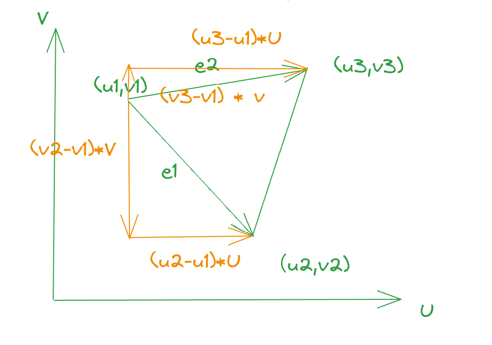

```math
e1= (u2-u1)*U+(v2-v1)*V \\
e2= (u3-u1)*U + (v3-v1)*V \\

\begin{pmatrix}
e1 \\
e2
\end{pmatrix}=
\begin{bmatrix}
(u2-u1) & (v2-v1) \\
(u3-u1) & (v3-v1)
\end{bmatrix}
\begin{pmatrix}
U^T \\
V^T
\end{pmatrix}\\
取：\\
a = u2-u1\\
b = v2-v1 \\
c = u3-u1 \\
d = v3-v1 \\


\begin{pmatrix}
e1 \\
e2
\end{pmatrix}=
\begin{bmatrix}
a & b \\
c & d 
\end{bmatrix}
\begin{pmatrix}
V^T \\
U^T
\end{pmatrix}\\
```

注意，这里的e1和e2和前面的e1、e2不是同一个东西。$`\begin{pmatrix} a & b \\ c & d \end{pmatrix}`$ 一定是可逆的。因为假如它不可逆的话，那么其两行就是线性相关的：

```math
\begin{bmatrix}
a & b \\
c & d 
\end{bmatrix} = 

\begin{bmatrix}
a & b \\
na & nb 
\end{bmatrix} \\
\begin{bmatrix}
a & b \\
na & nb 
\end{bmatrix}
\begin{pmatrix}
V^T \\
U^T
\end{pmatrix}
=\begin{pmatrix}
aV^T+bU^T \\
naV^T+nbU^T \\
\end{pmatrix}
=\begin{pmatrix}
e1 \\ 
e2
\end{pmatrix}
```

说明e1和e2也而线性相关的，而e1与e2作为三角形的两条边，显示是线性无关的，所以$`\begin{pmatrix} a & b \\ c & d \end{pmatrix}`$ 一定是可逆的.


**切空间法向量贴图**

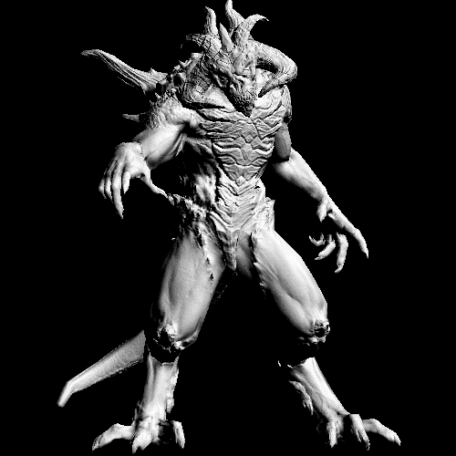
>cargo run --example texture_bumpmap_tangent


切空间法向量相对与世界坐标法向量的一个好处是切空间是一个相对与三角的局部空间，因此三角做了某种变换后，计算出来的法向量天然就是正确的。而世界坐标表示的法向量需要乘以[ 变换矩阵的逆转置](../../2.transform/4.3d-rotation/README.md#法向量变换矩阵)来对法向量做应变换使其仍然是变换后的模型的法向量。


|未旋转|绕y 45度|
|--|--|
|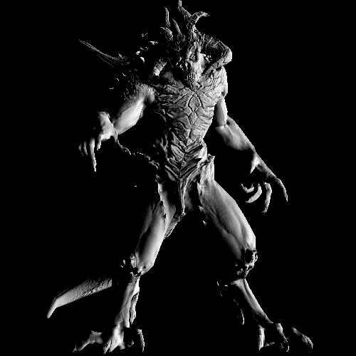|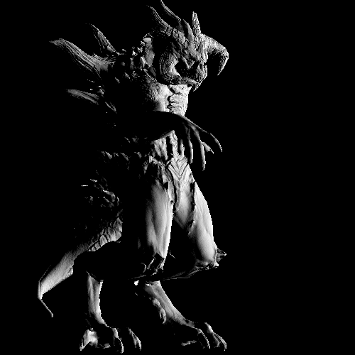
|cargo run --example texture_bumpmap_tangent_trans 0 |cargo run --example texture_bumpmap_tangent_trans 45 |
>为了方便想象，光线方向已改为水平向左

**切空间法向量纹理图为啥偏蓝**

上面所用的纹理图片如下,整体是偏蓝的：

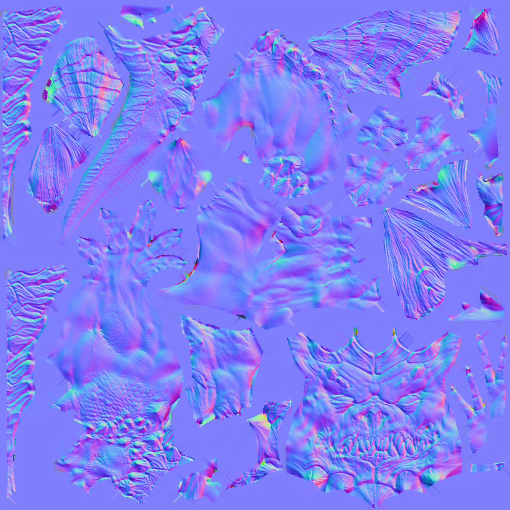

这是因为图片里存的是对原法向量的扰动，即下面的a,b,c. 对于没有扰动的情况：a=0,b=0,c=1, 映射成rgb即为(0,0,0.5) 是蓝色。扰动比较轻微的时候，a,b较小，c较接近1,rgb也偏蓝。


